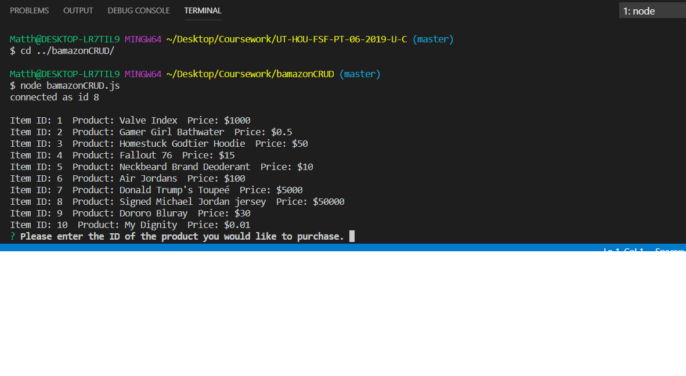
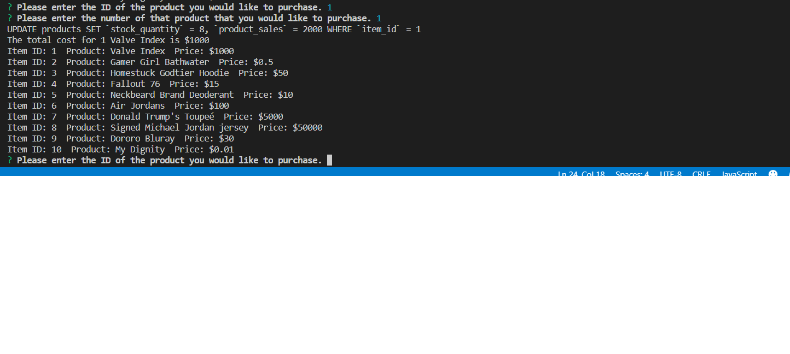
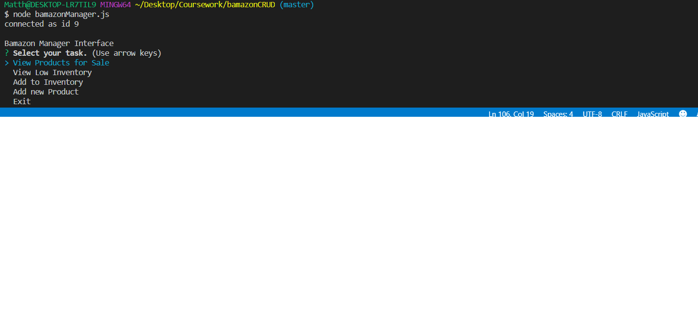
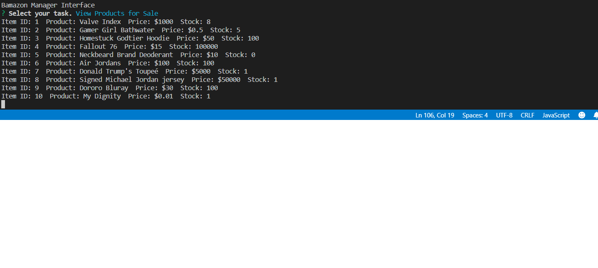
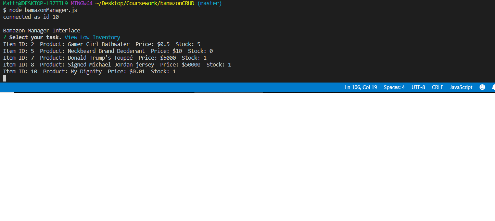
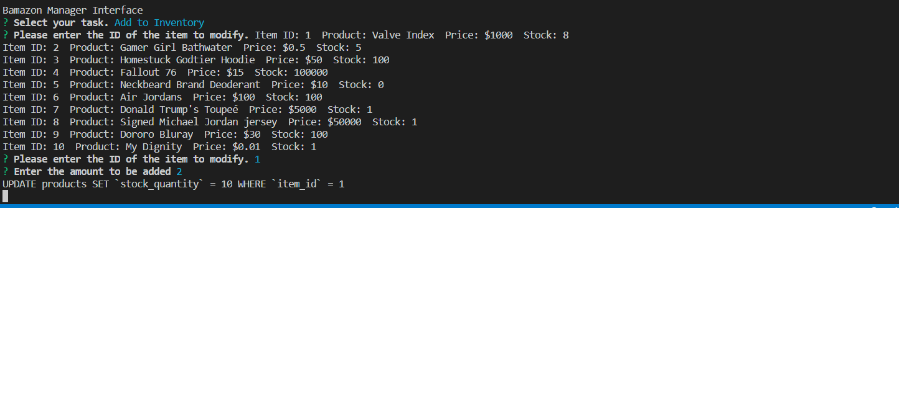
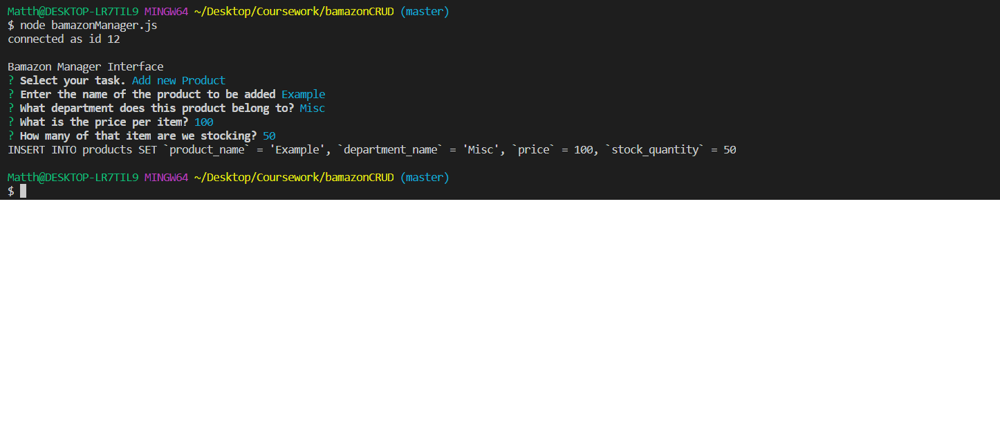
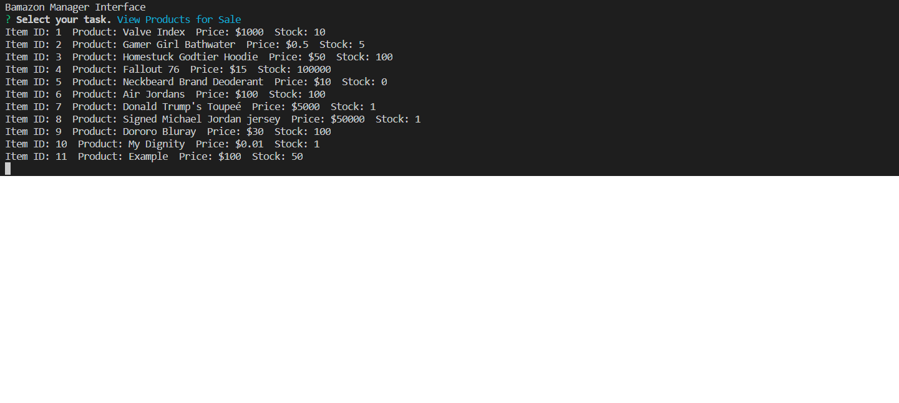

# bamazonCRUD

Bamazon is a mockup CLI App that utilizes MySQL to simulate a database for an amazon-like service for purchasing products online.  

This project is useful for managing the stock of a small business or online orders.

In these first couple screenshots, you can see the functionality for displaying the products and info about them to the user as well as allowing them to input how many of the item to purchase.

In these next screenshots, we see the functionality for the manager view.  

In this next bit, we adjust the stock of ID 1, the Valve Index, from 8 to 10.

Here, we add a new product to the table, called 'example'.  We set the department to misc, price to 100.00 and initial stock to 50.

Finally, this last screenshot reflects the changes we made have been incorporated into the database.

